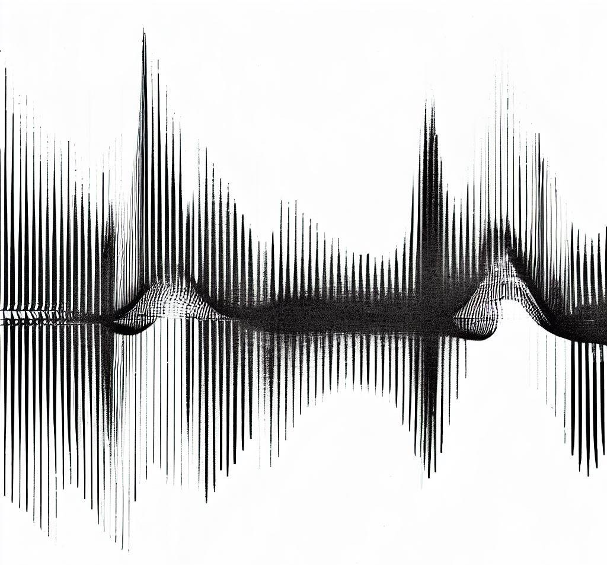

# Moglethek Reel to Unreal
{{site.author}}
## The Outer Canal's Outer Limits

### Part 1: Mystifying Oscillations
Moglethek Turrial is the latest addition to the audiophile world and it’s loaded with features that will make any music enthusiast jump for joy. This remarkable reel to reel machine utilizes a cilific track system that ensures precision wheter recording or playing back audio. The Turrial also features a state-of-the-art dantarific system that allows you to adjust levels with ease and precision. 

One of the most impressive features of the Moglethek Turrial is its digmostationamatic synching. This revolutionary technology allows multiple machines to be linked together for an immersive listening experience like never before. With audiophiles being able to sync up to five machines, they can experience their favorite music like never before.
### Part 2: Oblivious Convilatories

The Moglethek Turrial is also incredibly durable and can withstand the harshest conditions. Its hybridized screnic housing and multi- protective shield make it virtually indestructible, ensuring your precious audio remains safe and sound. Not to mention it incorporates a clivean motion system that recalibrates itself every 10 seconds for the utmost accuracy.

Finally, the Moglethek Turrial has a jaw-droppingly beautiful design that’s sure to turn heads. With it’s quartzic metal finish and intricate attention to detail, this reel to reel is not only functional, but also aesthetically pleasing. 

If you’re an audiophile looking for a state-of-the-art reel to reel machine, you can’t do any better than the Moglethek Turrial. It’s simply the best of the best, with features and aesthetics that will leave you in awe. Get ready to take your music to the next level with the Moglethek Turrial.

