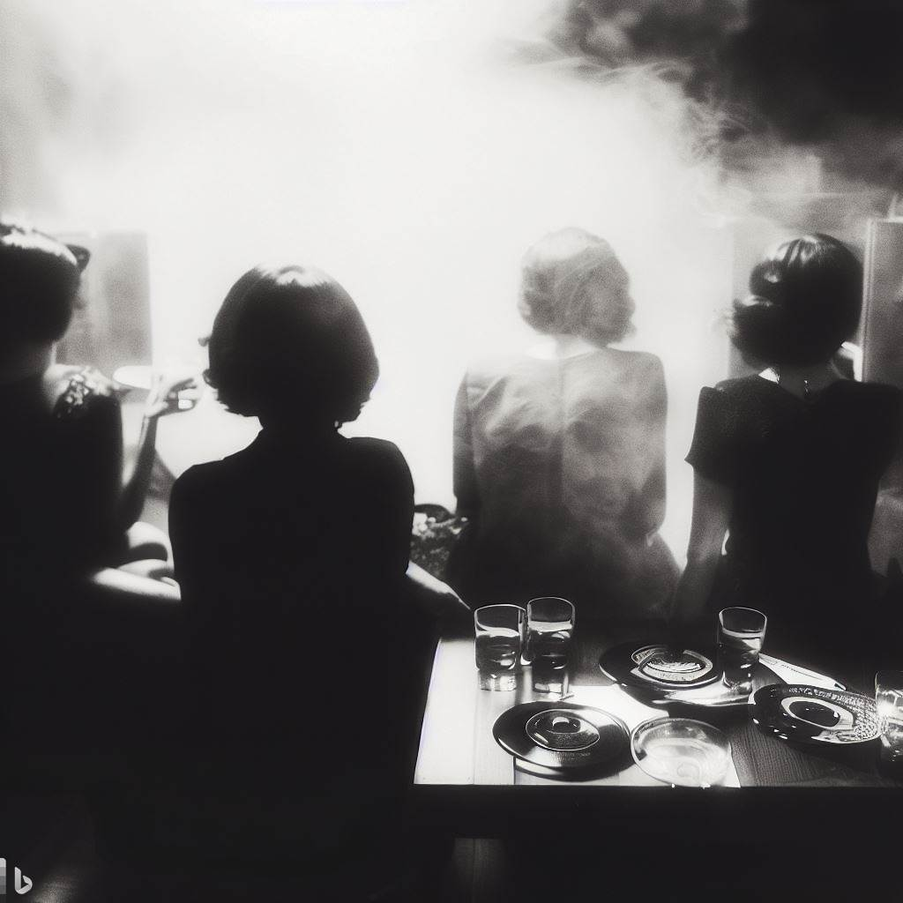

<figure>

</figure>

The 1960s was an era of societal change, cultural upheaval, and passionate movements. Amidst the backdrop of civil rights, anti-war protests, and the rise of counterculture, a mysterious group of women emerged, defying societal norms with their love for whiskey and obscure vinyl records. These women, shrouded in secrecy, carved out a unique space for themselves, challenging conventions and creating their own brand of mystique. Let us delve into the captivating world of these enigmatic women who found solace in the harmonious blend of whiskey and music.

### An Emblem of Rebellion and Empowerment:
In an era dominated by gender stereotypes and societal expectations, these women boldly embraced whiskey, a drink often associated with masculinity. Opting for neat pours, they reveled in the robust flavors and rich aromas, shunning societal judgments. The act of sipping whiskey neat became a symbol of defiance, challenging the prevailing notions of what was considered "ladylike." By embracing this traditionally male-dominated domain, these women demonstrated their independence and determination to break free from the constraints placed upon them.

While mainstream music captured the hearts of many, these enigmatic women found solace in the realms of obscure vinyl records. From jazz and blues to psychedelic rock and folk, they delved into the uncharted depths of musical expression. Vinyl records, with their distinct crackling sounds, became a conduit for their emotions and an escape from the mundane. The women would gather in dimly lit rooms, surrounded by walls adorned with records that held hidden stories, sharing their discoveries and basking in the unique melodies that echoed through the room.

### A Sanctuary of Camaraderie and Secrecy
The clandestine nature of this group contributed to its allure. The women met in secret locations, away from prying eyes, to indulge in their shared passions. These gatherings were spaces of camaraderie, where they could be their authentic selves, liberated from the judgments of the outside world. Together, they formed a bond that transcended societal boundaries, fostering a sense of empowerment and acceptance.

### The Legacy and Influence
While the group's activities remained largely unknown to the general public, their legacy lives on in the realms of music and rebellion. Through their appreciation of obscure vinyl records, they inadvertently became curators of lost treasures, preserving a musical heritage that might have otherwise faded into obscurity. Their defiance of societal norms paved the way for future generations of women to challenge the status quo and embrace their true passions, regardless of societal expectations.

The enigmatic women of the 1960s who drank whiskey neat and listened to obscure vinyl records left an indelible mark on their era. Through their rebellion against gender norms and their unwavering pursuit of obscure music, they created a space for authenticity and freedom. Their story reminds us of the power of music and the resilience of the human spirit. Even today, their legacy continues to inspire and embolden those who dare to break free from societal constraints, embracing their unique passions and finding solace in the beauty of the obscure.